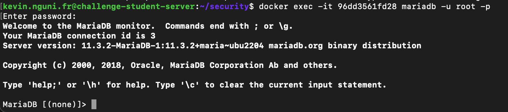
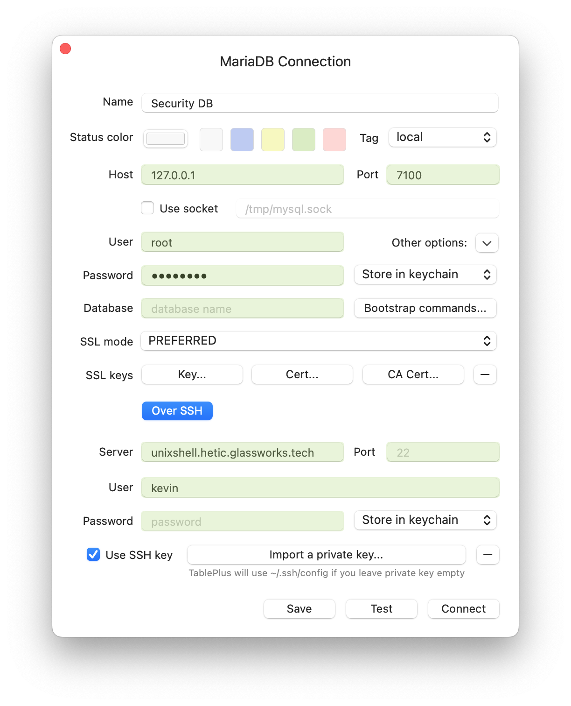

## Data

Cette section vous guidera dans la configuration de votre base de données :
- afin que les données soient cryptées au repos
- afin que les communications avec la base de données soient sécurisées
- afin que l'accès à la base de données soit sécurisé

## docker-compose.yml

Nous allons créer un sous-répertoire sur notre volume crypté pour stocker les données de notre SGBDR : 

```bash
mkdir /mnt/encrypteddata/data
```

Nous sommes prêts maintenant à rédiger une `docker-compose.yml` pour production, dans le fichier `/home/myinvoice/app/docker-compose.yml`.

Nous allons créer des variables d'environnement dans notre shell (qui persisteront uniquement la durée de notre SHELL), qui contiennent les coordonnées de l'utilisateur `root`  de notre SGBDR :


```bash
export MYSQL_ROOT_PASSWORD=abcd1234
```



C'est la bonne façon de traiter les données sensibles telles que les mots de passe. Nous ne voulons certainement pas les stocker dans un fichier qui pourrait être accidentellement livré à GIT, et nous ne voulons pas non plus les écrire dans le terminal, car ils pourraient être visibles dans notre historique.




Dans le `docker-compose.yml`, nous utilisons ces variables avec `${ NOM_DE_VARIABLE }`.



```yaml
version: '3.9'

services:
  dbms:
    image: mariadb
    restart: always
    # variables d'environnement à créer dans le container
    environment:      
      - MYSQL_ALLOW_EMPTY_PASSWORD=false
      - MYSQL_ROOT_PASSWORD=${MYSQL_ROOT_PASSWORD}
    # options de lancement (encodage)
    command: [
      "--character-set-server=utf8mb4",
      "--collation-server=utf8mb4_unicode_ci",
    ]
    volumes:
      # stocker les données sur le volume cryptée : /mnt/encrypteddata/data
      - /mnt/encrypteddata/data:/var/lib/mysql
    networks:
      # Ce service existera sur le réseau virtuel suivant
      - api-network
      
networks:
  api-network:
    driver: bridge
    name: api-network
```


On lance notre DB avec :

```bash
docker compose up -d
```

## Connexion via le terminal

Par défaut, toutes les installations de MariaDB viennent avec un client qui s'appelle **mariadb**. Ce client permet d'ouvrir un interprète et envoyer de commandes au SGBDR.

Nous pouvons, sans rien installer, établir une connexion au SGBDR en ouvrant un shell interactif au Container, et en lançant la commande :

D'abord, identifiez bien le ID de votre Container Mariadb :

```bash
docker container ls
```

Une fois repéré l'ID du container (dans mon exemple, le ID est `794b579cd610`) :

```bash
docker exec -it 794b579cd610 mariadb -u root -p
```

<figure><figcaption></figcaption></figure>

Vous pouvez executer du SQL en tant que `root` :

```sql
create database my_invoice;
show databases;
```


## Importer des données

Vous pouvez importer des données via le terminal aussi.

Tout d'abord, il est nécessaire de transférer vos fichiers SQL contenant le schéma de votre base de données et les données d'initialisation vers la machine distante.

Ces fichiers sont fournis dans le projet MyInvoice, sous `src/migrations`.

Vous pouvez les copier depuis votre machine locale vers le serveur distant à l'aide de SCP. Veuillez d'abord ouvrir un nouveau terminal sur votre machine locale. Ensuite, veuillez saisir :

```bash
scp -i /chemin/vers/votre/clé/privée src/migrations/* myinvoice@55.55.55.55:/home/myinvoice/app/seed/
```

Importez des données :


```bash
# Importer les schémas
docker exec -i 794b579cd610 mariadb -u root -p$MYSQL_ROOT_PASSWORD my_invoice < /home/myinvoice/app/seed/migration.001.sql
...
```

N'oubliez pas de préciser la variable d'environnement `MYSQL_ROOT_PASSWORD` si vous avez ouvert un nouveau terminal !

Reconnectez-vous à votre base de données. Vous devriez voir des tables !

```sql
use my_invoice;
show tables;
```

## Connexion de votre machine locale

Disponible à [https://tableplus.com](https://tableplus.com) pour MacOS et Windows.

<figure><figcaption></figcaption></figure>

<figure><figcaption></figcaption></figure>

Vos coordonnées de connexion devront être :

* _Nom d'hôte_ : `l'adresse IP de votre serveur`
* _Port_ : 3600
* _Nom d'utilisateur_ : `root`
* _Mot de passe_ : `votre motre de passe root`

Essayez d'établir une connexion. Cela fonctionne comme attendu ? Pourquoi ?

## Exposer le port docker


Votre connexion n'a pas fonctionné car Docker n'expose pas automatiquement les ports des processus qu'il exécute au monde extérieur.

Cela peut être un moyen très pratique de sécuriser vos applications du monde extérieur !

Pour un SGBDR cependant, nous voulons pouvoir nous connecter depuis le monde extérieur pour pouvoir effectuer des tâches administratives, nous sommes donc obligés d'exposer un port.
Modifiez votre `docker-compose.yml` et ajoutez l'entrée `ports` :


```yaml
version: '3.9'

services:
  dbms:
    image: mariadb
    ...
    
    # port-externe (hôte) : port-interne (container)
    ports:
      - "7100:3306"    
    
    ...
```


Notez que, par défaut, les applications SGBDR telles que MySQL et MariaDB écoutent sur le port 3306. 

Ici, nous exposons le port 7100, un port qui n'est pas typiquement associé à MySQL. Cela signifie qu'un port-scanner peut ne pas trouver le service, ou ne pas savoir immédiatement quels sont les vecteurs d'attaque disponibles.

Redémarrez votre service :


```bash
docker compose down
docker compose up -d
```

La liste de vos conteneurs révélera que votre port est maintenant exposé :

```bash
docker ps

# e9f05406c881   mariadb "docker-entrypoint.s…"   3 seconds ago   Up 2 seconds   0.0.0.0:7100->3306/tcp, :::7100->3306/tcp     security-mon_sgbdr-1
```

Réessayez de vous connecter à TablePlus, en spécifiant cette fois le port 7100. 

## Obliger une connexion sécurisée

Actuellement, toute communication avec notre SGBDR sera non crypté. 

Idéalement, nous souhaitons que toutes les communications administratives de TablePlus soient cryptées. Nous pouvons le faire en utilisant SSH :



Notez que le `Host` change en `127.0.0.1`, puisque c'est l'adresse du SGBDR une fois que la connexion SSH est créée. Dans la partie SSH de la configuration, nous fournissons notre fichier de clé privée qui nous donne accès à notre serveur


Pour l'instant, il est possible de se connecter à la base de données avec ou sans SSH. Des accidents peuvent survenir, et nous pouvons nous connecter accidentellement via une connexion non sécurisée.
.

Idéalement, [on sécurise des communications avec TLS](https://mariadb.com/docs/server/security/data-in-transit-encryption/enterprise-server/enable-tls/). C'est l'équivalent de la connexion SSL qu'on voit dans les navigateurs. Non seulement on établit des connexions cryptées, mais aussi, on établit un niveau de confiance auprès de notre base de données.

En revanche, créer des certificats exige un nom de domaine, qu'on n'a pas encore. Je vous encourage quand même à suivre le guide marque dessus.

Pour ce cours, nous nous contenterons à **obliger des connexions via SSH exclusivement**. C'est-à-dire, nous devons d'abord établir un tunnel SSH vers l'instance hôte, et ensuite envoyer des commandes via ce tunnel crypté.

Ceci est facile avec Docker ! Nous modifions notre `docker-compose.yml`, en ajoutant `127.0.0.1` devant le port qu'on a ouvert :


```yml

version: '3.9'

services:
  dbms:
    image: mariadb
    ...
    # port-externe (hôte) : port-interne (container)
    ports:
      - "127.0.0.1:7100:3306"    
    ...
```

En ajoutant `127.0.0.1`, nous signalons à Docker qu'il faut accepter uniquement les connexions provenant de l'hôte même, et pas du monde extérieur. 

Essayer : modifiez vous-même votre `docker-compose.yml`, redémarrez votre service, et essayez de vous connecter via votre client local.

La seule façon d'établir une connexion du monde extérieur est d’établir d'abord une connexion SSH à l'instance. Dans votre client, vous auriez l'option de configurer la connexion SSH et fournir la clé privée nécessaire pour la connexion.




**Connexions par SSH**

Cette stratégie implique que même vos APIs doivent se connecter via SSH, qui n'est pas forcément voulu, surtout s'ils existent sur le réseau local. À ce moment-là, on n'ouvre pas de port du tout (on enlève la partie `ports` du `docker-compose.yml`). Seulement les services qui existent sans le réseau docker auront accès (mais en non sécurisé).

Sinon, on peut aussi créer des tunnels SSH dans nos APIs, si nécessaire avec des librairies tierces (ex. [ssh2 pour nodejs](https://github.com/mscdex/ssh2)). En revanche, nous créons une dépendance sur une tech basée sur l'architecture de prod qui n'est pas idéal.

Enfin, il sera peut-être prudent de suivre les démarches de mise en place des certificats TLS. Cette solution est effectivement plus souple dans le long terme.





## Sécuriser MariaDB

MySQL (et MariaDB) contient par défaut un script qui permet d’affecter des règles de sécurité de base

* Désactiver les connexions anonymes
* Assurer des utilisateurs admin/root ne peuvent connexion uniquement par la machine locale
* Assurer que l’utilisateur `root` a un mot de passe (et qu’il est suffisamment sécurisé)
* Supprimer la base de données de test (parfois installé par défaut)

```sh
docker exec -it [Container ID] mysql_secure_installation
```


## Privilèges

Jusqu'au présent nous nous sommes connectés à la base de données en tant que `root`, qui a tous les droits d'administration.


Il ne faut *jamais* communiquer les coordonnées de l'utilisateur `root` ! 

Et en plus, normalement, on désactive les connexions en tant que `root` provenant des adresses IP en dehors de notre entreprise !


Il faut donc créer d'autres utilisateurs, et finement gérer leurs accès aux *databases* au sein du SGDBR.


## Utilisateurs

Les utilisateurs dans un SGBDR type MySQL ou MariaDB s'identifie par un *nom* et une *adresse*. L'idée est qu'on sécurise l'accès de quelqu'un en fonction de son endroit de connexion.

C'est très pratique ! On peut limiter l'accès à un utilisateur uniquement d'au sein d'un réseau privé. Par exemple :

- l'utilisateur `root` ne peut se connecter seulement via la machine locale et pas d'une machine distante. Cela veut dire qu'on doit d'abord se connecter en SSH au terminal de la machine, avant de se connecter à MySQL.
- un utilisateur pour une API qui aura des privilèges de lecture et écriture sur une certaine base est limité au réseau privé de l'entreprise.


### Créer un utilisateur 

On utilise la commande suivante :

```sql
create user 'kevin'@'%.%.%.%' identified by 'password';
```

On crée un utilisateur qui s'appelle `kevin`, qui peut se connecter de *tous les réseaux* (`%.%.%.%`) qui aura besoin d'un mot de passe `password`.

Pour créer un utilisateur limité à un réseau interne, par exemple :

```sql
create user 'kevin'@'10.1.%.%' identified by 'password';
```

Notez qu'on peut créer plusieurs utilisateurs du même nom, avec une provenance différente.

### Lister les utilisateurs

La liste d'utilisateurs actifs se trouve dans une *database* interne qui s'appelle `mysql`, sur la table `user`. Il suffit de les lister :

```sql
SELECT user, host FROM mysql.user;
```

Nous verrons le nom d'utilisateur, ainsi que l'hôte autorisé pour la connexion. Par exemple :

```
MariaDB [saas]> SELECT user, host FROM mysql.user;
+-------------+-----------+
| User        | Host      |
+-------------+-----------+
| root        | %         |
| kevin       | %.%.%.%   |
| mariadb.sys | localhost |
| root        | localhost |
+-------------+-----------+
```

### Supprimer un utilisateur

Pour supprimer un utilisateur, on utilise commande `drop` :

```sql
drop user `kevin`@`%.%.%.%`;
```

### Mettre à jour un mot de passe

On peut mettre à jour un mot de passe d'un utilisateur en le modifiant :

```sql
alter user 'kevin'@'%.%.%.%' identified by 'newpassword';
```

## Privilèges

Une fois les utilisateurs créés, il faut les accorder accès à un ou plusieurs *databases* dans notre SGBDR.


On accorde le minimum de privilèges nécessaires pour faire son travail, et jamais plus.

C'est ainsi qu'on protège au maximum notre base de données des tentatives de hack!

Pensez toujours au pire, puis voir comment on peut limiter les dégâts !


Nous allons accorder accès sur 2 dimensions principales :

- Les actions autorisées…
  - ... sur une *database* particulière
  - ... sur une table particulière

Par exemple :

```sql
grant all privileges on my_invoice.* to 'kevin'@'%.%.%.%';
```

Ici, on accorde à `kevin` la possibilité de *tout faire* sur la base de données `my_invoice`. Ce n'est pas très sécurisée, car l'utilisateur peut non-seulement tout lire, mais aussi modifier la base (par exemple, supprimer les tables) !


Quels privilèges alors ? Cela dépend de l'utilisateur :

- un *administrateur* peut créer et supprimer des bases
- une appli type API ne doit pas pouvoir modifier le schéma d’une base de données, mais uniquement *insérer*, *lire* et *modifier*, et peut-être *supprimer* des lignes dans des tables
- une appli tierce (d'un partenaire), devrait *lire* exclusivement les contenus, mais aucun droit d'écriture n'est accordée.



Imaginons qu’un app API est hacké, et le hacker arrive à imiter l’API. Le hacker aura les mêmes droits que l’API.

Si on a accordé `ALL PRIVILEGES` à l’utilisateur de l'API, le hacker peut tout voir, tout supprimer ou bien tout crypter pour demander une rançon.



Pour un API par exemple :

```sql
create user 'api'@'10.1.%.%' identified by 'very-strong-password';
grant SELECT, UPDATE, INSERT, DELETE on my_invoice.* to 'api'@'10.1.%.%';
```

On peut consulter les privilèges accordés à un utilisateur :

```sql
show grants for 'api'@'10.1.%.%';
```

On peut enlever les privilèges avec `revoke` :

```sql
revoke all privileges on 'my_invoice'.* from 'kevin'@'%.%.%.%';
```

Enfin, quand on a tout modifié à notre satisfaction, on sauvegarde nos modifications pour qu'elles soient prises en compte par le SGBDR :

```sql
flush privileges;
```

La liste de privilèges possibles dans un SGBDR type MariaDB peut être consulté au lien suivant : [https://mariadb.com/kb/en/grant/](https://mariadb.com/kb/en/grant/)

## Exercice

Créez un nouvel utilisateur sur votre base, qui s'appelle `apiprod` sans accorder de privilèges. Essayez d’accéder à la base avec votre client préféré.

Accordez des privilèges pour un utilisateur du type « API » (créer, modifier, visionner, supprimer). Testez votre utilisateur avec votre client.


