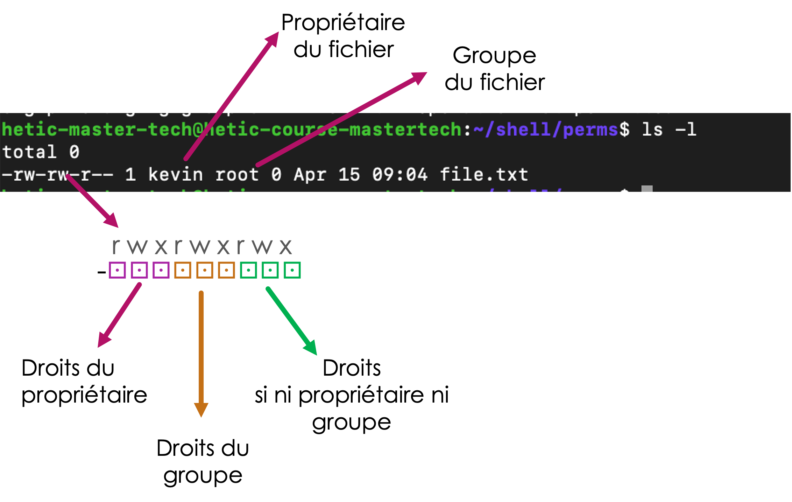

# Essentiels de la sécurité

Le système de fichiers Unix est la première étape de la sécurisation d'un serveur physique et de son système d'exploitation contre les attaques malveillantes.

A la base d'un système de sécurité est la notion d'identité. Il faut d'abord savoir qui vous êtes avant de valider si vous avez accès ou pas.

## Utilisateur

On ne peut pas accéder à une invite de commandes Unix sans d'abord s'identifier. Le plupart du temps on se connect avec un nom d'utilisateur et mot de passe (ou clé SSH).

L'identité unique est donc centrale !

Comment on peut lister les utilisateurs inscrits sur la machine ? C'est stocké simplement dans le fichier `/etc/passwd`;

```bash
cat /etc/passwd
```

Ce fichier de configuration contient les informations des comptes utilisateurs :

* Le nom de l’utilisateur
* Le hash du mot de passe
* Divers identifiants (user ID, groupe ID)
* L’emplacement de son dossier maison
* Le shell à utiliser quand il/elle se connecte

Comment ajouter un utilisateur ? Selon votre système Unix, un des deux commandes suivantes pourront fonctionner pour vous :


```bash
# Ajouter l'utilisateur 'kevin'
adduser kevin

# Ajouter l'utilisateur 'kevin' et lui créer un dossier maison, en l'ajoutant au groupe `students`
useradd -m -g students kevin
```

A noter, normalement il faut être administrateur pour ajouter un utilisateur, c'est à dire, dans le groupe `sudo` pour avoir le droit. Dans ce cas, il faudrait ajouter `sudo` devant chaque commande :

```bash
# Ajouter l'utilisateur 'kevin'
sudo adduser kevin

# Ajouter l'utilisateur 'kevin' et lui créer un dossier maison, en l'ajoutant au groupe `students`
sudo useradd -m -g students kevin
```


## Groupes

En tant qu'utilisateur, je pourrais aussi participer dans un ou plusieurs _groupes_.

Un groupe est juste une collection d'utilisateurs.

Par exemple. Imaginons qu'on a deux utilisateurs, `hetic` et `kevin`. Chaque utilisateur peut appartenir à zéro, un ou plusieurs groupes :

* Groupe : `sudo`
  * Utilisateur : `hetic`
  * Utilisateur : `kevin`
* Groupe : `docker`
  * Utilisateur : `kevin`

Ici, les deux utilisateurs se trouvent dans le groupe `sudo`, mais seulement `kevin` se trouve dans le groupe `docker`. Dans cette exemple, cela veut dire que `kevin` pourrait éventuellement lire et modifier les fichiers du groupe `docker`. L'utilisateur `hetic` ne pourra pas.

Comment voir tous les groupes de l'installation ?

```bash
# Lister tous les groupes sur l'installation UNIX
cat /etc/group

# Voir les groupes de l'utilisateur actuel
groups [nom d'uilisateur]

# Ajouter un nouveau groupe
groupadd [nom du groupe]

# Affecter un utilisateur à un groupe 
usermod -aG [group] [utilisateur]

# Lister les utilisateurs dans un groupe 
# (Peut changer en fonction de votre distribution)
getent group [group]

# Enlever un utilisateur d’un groupe (dépendant de la distro):
gpasswd -d [utilisateur] [group]
deluser [utilisateur] [group]

# Supprimer un group : 
groupdel [group]
# Supprimer un utilisateur : 
userdel -r [utilisateur]
# Le –r supprime aussi son répertoire home
```

Essayez de créer des utilisateurs et groupes !

Une fois que je suis identifié, j'aurais un certain nombre de droits selon 3 catégories :

* Les droits accordés à moi-même uniquement
* Les droits accordés aux _groupes_ dont je fait parti
* Les droits accordés à _tous les utilisateurs_ de l'installation UNIX

Ces droits sont exprimés sur chaque fichier / répertoire.

## Actions

Une fois l'identité établie, on aimerait savoir et contrôler l'action à effectuer. Sur UNIX il y a 3 actions :

* Lire
* Écrire
* Exécuter

L'action _lire_ regroupe non-seulement l'ouverture d'un fichier pour le visionner (avec `nano` par exemple), mais aussi la possibilité de _voir_ le fichier avec `ls`. Si un utilisateur n'a pas les droits de lecture sur un fichier, ce fichier sera invisible, malgré les options qu'on passe à `ls`.

L'action _ecrire_ est simple : je ne peux pas modifier ou supprimer un fichier si je n'ai pas ce droit. Je ne peux pas non plus créer des nouveaux fichiers dans un répertoire dont je n'ai pas ce droit.

L'action _exécuter_ regroupe deux actes :

* naviguer dans un répertoire (avec `cd` par exemple)
* lancer une commande ou un fichier executable.


## Permissions


Les droits (_lire, écrire, exécuter_) sont attribués à chaque fichier de notre système de fichiers.

En effet, en effectuant un `ls -l` pour un fichier, on vois les droits, le nom du propriétaire du fichier, et le nom du groupe à qui appartient le fichier :

<figure><figcaption></figcaption></figure>

La première partie de la ligne exprime un certain nombre de caracteristiques de notre fichier :

| Bit | Qui                                 | Quoi                                                       | Explication                                              |
| --- | ----------------------------------- | ---------------------------------------------------------- | -------------------------------------------------------- |
| 0   |                                     | Le type du fichier : `-` pour fichier, `d` pour répertoire |                                                          |
| 1   | Propriétaire du fichier             | Lecture                                                    | `-` pour pas lisible, `r` pour lisible (_r_ead)          |
| 2   | Propriétaire du fichier             | Ecriture                                                   | `-` pour pas modifiable, `w` pour modifiable (_w_rite)   |
| 3   | Propriétaire du fichier             | Exécution                                                  | `-` pour pas exécutable, `x` pour exécutable (e_x_ecute) |
| 4   | Un membre du même groupe du fichier | Lecture                                                    | `-` pour pas lisible, `r` pour lisible (_r_ead)          |
| 5   | Un membre du même groupe du fichier | Ecriture                                                   | `-` pour pas modifiable, `w` pour modifiable (_w_rite)   |
| 6   | Un membre du même groupe du fichier | Exécution                                                  | `-` pour pas exécutable, `x` pour exécutable (e_x_ecute) |
| 7   | Tout le monde                       | Lecture                                                    | `-` pour pas lisible, `r` pour lisible (_r_ead)          |
| 8   | Tout le monde                       | Ecriture                                                   | `-` pour pas modifiable, `w` pour modifiable (_w_rite)   |
| 9   | Tout le monde                       | Exécution                                                  | `-` pour pas exécutable, `x` pour exécutable (e_x_ecute) |

Dans l'exemple :

* l'utilisateur `kevin` est le propriétaire du fichier
  * l'utilisateur `kevin` peut lire et modifier le fichier, mais il ne peut pas l'exécuter
* le fichier appartient au groupe `root`
  * un autre utilisateur dans le même group `root` peur lire et exécuter le fichier.
* Pour un utilisateur lambda, disons `hetic` :
  * `hetic` n'est pas l'utilisateur `kevin`, donc on ignore les bits 1,2,3
  * `hetic` n'est pas dans le groupe `root`, donc on ignore les bits 4,5,6
  * `hetic` peut donc seulement lire le fichier, mais il ne peut pas le modifier


Il y a plus d’utilisateurs que vraie personnes dans une installation Unix. Ils n’ont pas tous des dossiers home, par exemple. On crée des utilisateurs et groupes pour des processus qui tournent sur la machine. L’idée est de finement contrôler les processus globaux, leur donnant accès seulement aux fichiers dont ils ont besoin, et pas plus.

> :bulb: C'est pourquoi les virus ne fonctionnent pas super bien sur Unix, ils n'ont souvent pas les droits suffisants pour vraiment faire du mal !

Par exemple, Apache (le serveur web) :

* Apache crée un utilisateur et groupe : `www-data`
* Apache tourne en tant que cette utilisateur
* Un fichier qui doit être servi par Apache doit être lisible par Apache :
  * Il faut un `r` dans le bit du propriétaire du fichier, si le propriétaire est `www-data`
  * Ou, il faut un `r` dans le bit du groupe du fichier, si le fichier est du groupe `www-data`
  * Ou, il faut un `r` dans le bit pour tous les utilisateurs
* Ca veut dire que n’importe quel fichier qui n’est pas lisible selon les conditions dessus ne sera pas divulgué par erreur via Apache. Attention, l'inverse est vrai aussi !
* C’est la raison pour laquelle on ne tourne pas des processus comme Apache, nginx etc en tant que `root`. On risque de divulger n'importe quel fichier de configuration a grand public !

Autres exemples: `docker`, `mail`, `ssh`, etc.

## Changer le propriétaire/groupe

Par défaut, le créateur d'un fichier sera son propriétaire. La plupart du temps chaque utilisateur dispose d'un group à lui aussi. Dans l'exemple suivant, on voit que le nouveau fichier `test` a `hetic` comme utilisateur et groupe.

```bash
hetic@eabaf4e7983c:~$ touch test
hetic@eabaf4e7983c:~$ ls -l test
-rw-r--r-- 1 hetic hetic 0 déc.  22 19:29 test
```

On peut, en revanche, modifier l'utilisateur et group avec la commande `chown` :

```bash
chown [propriétaire]:[groupe] [fichier à modifier]
```

Par exemple, on change le propriétaire à `root` et le groupe à `myparty`:

```
# Créer un groupe pour cet exemple 
hetic@eabaf4e7983c:~$ sudo groupadd myparty

hetic@eabaf4e7983c:~$ chown root:myparty ./test
hetic@eabaf4e7983c:~$ ls -l test
-rw-r--r-- 1 root myparty 0 déc.  22 19:29 test
```

> Attention :
>
> * un utilisateur normale ne peut pas changer le propriétaire d’un fichier, même s’il est propriétaire !
> * Il peut affecter le fichier à un group, seulement si l’utilisateur fait déjà parti du group !

On peut aussi changer le propriétaire et groupes de tout un sous-hierarchie de fichiers et répertoires :

```bash
chown -R [owner]:[group] [répertoire]
```

## Accorder/retirer des droits

On modifie les bits d'un fichier avec la commande `chmod`.

Chaque triplet se compose de 3 bits (r, w, x) : Si tout est activé sur 3 bits, on a une valeur de 7, parce que c'est la somme des 3 bits, 111 :

$$1*2^0 + 1*2^1 + 1*2^2 = 7$$

Autres exemples:

* `-wx` = `011` =&#x20;

&#x20;$$1*2^0 + 1*2^1 + 0*2^2 = 3$$

* `r-x` = `101` =&#x20;

$$1*2^0 + 0*2^1 + 1*2^2 = 5$$

`chmod` prend donc 3 entiers entre 0 et 7 :

* le premier entier pour préciser les droits du propriétaire
* le deuxième entier pour préciser les droits du groupe
* le troisième entier pour préciser les droits pour tout le monde

Par exemple :

```bash
chmod 754 test.txt
```

* Accorde `rwx` au propriétaire
* Accorde `r-x` au groupe
* Accorde `r--` au publique

Il y a une autre façon de modifier un bit seul avec `chmod` :

```bash
chmod [u|g|o|a][+|-][r|w|x] [fichier]
```

Ou :

* u = propriétaire
* g = groupe
* o = autres
* a = tout (défaut)

Exemples:

```bash
# Autoriser l’exécution sur le fichier par le propriétaire
chmod u+x script.sh

# Enlever le droit d’exécution de tout les utilisateurs
chmod -x script.sh

# Autoriser le groupe à écrire
chmod g+w file.txt
```


## Exercice

Dans le [dernier chapitre](./ssh.md), vous avez accordé l'accès à tous les membres de votre équipe pour l'utilisateur root.

Cela est en réalité très risqué, et généralement, nous réservons l'accès root aux administrateurs uniquement.

Dans cet exercice :

- configurez un utilisateur unique pour chaque membre de votre équipe
- chaque membre doit pouvoir se connecter à son propre compte via SSH


