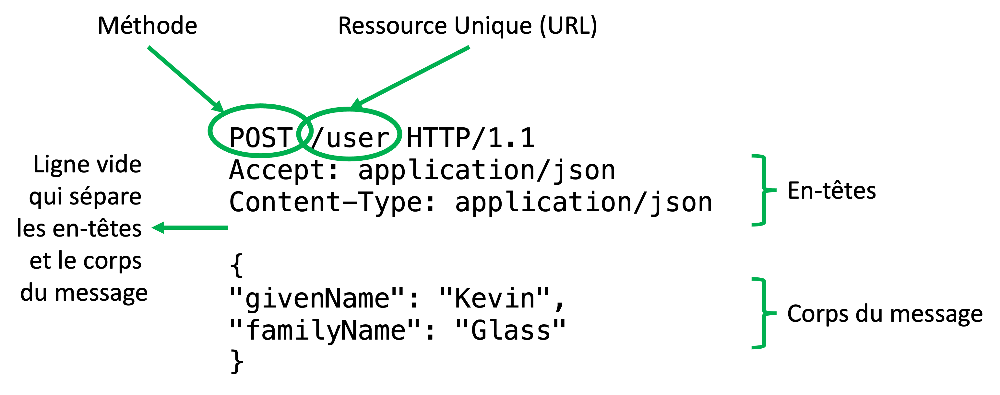

# HTTP

Sur l'internet, un protocole a émergé qui gère la majorité des échanges de données sur le web : **HTTP**.

Dans ce cours, nous nous concentrerons sur les API basées sur le protocole HTTP. C'est-à-dire une API qui écoute une URL particulière et répond aux requêtes HTTP.

Mais qu'est-ce que HTTP ?

**H**yper**T**ext **T**ransfer **P**rotocol - un protocole inventé initialement pour l'échange des fichiers texte entre deux machines.

Le protocole est basé sur une connexion TCP, et se compose d'une requête est une réponse :

- Un **client** établit une connexion TCP avec le **serveur** (en bref, des paquets d'initialisation se sont envoyés entre les deux machines).
- Le client envoie du texte d'un certain format au serveur. Ce texte exprime la ressource demandée (la requête), ainsi que des paramètres supplémentaires.
- Le serveur renvoie une réponse texte (la ressource demandée) via la même connexion TCP
- La connexion TCP est fermée.

Voici un exemple du texte HTTP envoyé à un serveur :

```
POST /user HTTP/1.1
Accept: application/json 
Content-Type: application/json

{
  "givenName": "Kevin",
  "familyName": "Glass"
}
```


Ce flux de texte se compose en *lignes* séparées par des nouvelles lignes. 

- Première ligne : `ACTION` suivi par la ressource demandée (en forme d'url), suivi par la version du protocole 
- Lignes suivantes : une série d'entêtes en forme `CLÉ: VALEUR`
- Une ligne vide qui signale la fin de l'entête et le début des données
- Les données



Voici un exemple d'une réponse HTTP renvoyé au client :

```
HTTP/1.1 200 OK
Access-Control-Allow-Origin: *
Content-Type: application/json

{
  "ok": true
}
```

## Example

Le gouvernement français dispose d'un certain nombre d'API qui nous permettent de récupérer des informations publiques.

L'une de ces API concerne les adresses : [https://adresse.data.gouv.fr/api-doc/adresse](https://adresse.data.gouv.fr/api-doc/adresse)

Nous pouvons nous entraîner à envoyer une requête HTTP brute à cette API avec `telnet` ou `openssl`:


```bash
openssl s_client -connect api-adresse.data.gouv.fr:443
GET /search/?q=8+bd+du+port
```



Vous connaissez une API à votre disposition ? Essayez d'interagir avec l'API en utilisant uniquement `telnet` ou `openssl` !



## Méthodes

Le premier mot d'une requête HTTP est la méthode. Il peut s'agir d'une des nombreuses méthodes disponibles :

- `GET` : pour récupérer des données
- `POST` : pour envoyer des données dans le corps du message
- `PATCH` : pour envoyer des données, principalement pour mettre à jour des données existantes
- `PUT` : pour envoyer des données dans le corps du message, principalement pour créer ou remplacer des données
- `DELETE` : pour supprimer des données

Pendant l'interpretation des méthodes `GET` et `DELETE`, les **corps du message** est ignoré. Pour les autre méthodes, le corps du message est interprété.

## URL

Le URL, ou **Uniform Resource Locator**  spécifie un chemin unique vers une ressource sur ce serveur. Généralement, le chemin unique est séparé par des slash (`/`).

Le serveur doit savoir comment interpréter ce chemin pour récupérer les données associées (ou les mettre à jour, si la méthode est POST, PUT ou PATCH).

L'URL peut contenir des informations supplémentaires pour aider à localiser la ressource :

- Paramètres d'URL : Nous pouvons intégrer des identifiants uniques dans une URL comme suit : `/user/:userId/comment/:commentId`. Par exemple, `/user/143/comment/1459` identifiera l'utilisateur numéro 143, et son commentaire numéro 1459.
- Paramètres de requête : nous pouvons ajouter des options supplémentaires après l'URL, par exemple : `/user/143/comments?page=1&limit=10`. Dans cet exemple, il y a 2 paramètres de requête : `page` et `limit` qui peuvent être analysés pour récupérer leurs valeurs respectives `1` et `10`.

## En-têtes

Les en-têtes fournissent des métadonnées sur la demande. Il existe de nombreux en-têtes HTTP standardisés. En voici quelques-uns :
- `Authorisation` : fournit un secret qui peut être utilisé pour identifier la personne qui envoie la requête.
- `Content-Type` : fournit des informations sur le format des données demandées. Par exemple, `text/html` (texte brut), `image/png` pour une image, etc. Cherchez `mime types` dans Google pour savoir les options possibles.
- `Accept` : le type de contenu qui se trouve dans le corps du message. Il peut s'agir de JSON, SOAP, de données d'images brutes, de données base64, de données de formulaire, etc.
- ... et bien d'autres choses encore

## Corps du message

Le corps du message peut contenir n'importe quel type de données textuelles, binaires ou autres. Lorsque nous créons ou mettons à jour des données sur le serveur, nous envoyons généralement ces données dans le corps du message, car elles peuvent être volumineuses.

La plupart des API modernes utilisent le format FormData, JSON ou XML dans le corps du message.

Un exemple de JSON :

```json
{
  "message": "This is a message",
  "ok": true,
  "values": [
    "We",
    "Can",
    "Send",
    "Arrays"
  ],
  "address": {
    "road": "16 rue Abel",
    "city": "Paris",
    "code": "75012"
  }
}
```

Un exemple de XML :

```xml
<?xml version="1.0" encoding="UTF-8" ?>
<root>
  <message>This is a message</message>
  <ok>true</ok>
  <values>We</values>
  <values>Can</values>
  <values>Send</values>
  <values>Arrays</values>
  <address>
    <road>16 rue Abel</road>
    <city>Paris</city>
    <code>75012</code>
  </address>
</root>
```