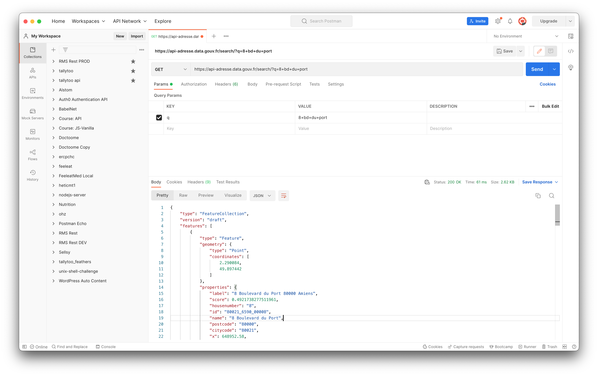

# Consommer un API

Il existe de nombreuses façons de consommer les API qui sont plus faciles que les méthodes HTTP directes.

## CURL

CURL est un outil de ligne de commande basé sur Linux qui permet d'effectuer des requêtes HTTP. Par exemple :

```bash
curl "https://api-adresse.data.gouv.fr/search/?q=8+bd+du+port"
```

Ceci enverra une requête `GET` à l'URL, et imprimera les données retournées au shell.

## Javascript `fetch`

Javascript contains the `fetch`

```js
fetch(
  "https://api-adresse.data.gouv.fr/search/?q=8+bd+du+port", {
      method: "GET" // default, so we can ignore
  }
).then(
  (response) => {    
    return response.json()
  }
).then(
  (json) => {
    console.log(json);
  }
)

```

Ouvrez un nouveau navigateur, ouvrez la console de développement et collez le code ci-dessus. Vous verrez les résultats apparaître dans la console du navigateur !


## Postman

Pour le développement et les tests, des outils tels que Postman sont très utiles pour tester nos API.

Nous pouvons définir n'importe quel type de requête HTTP, la méthode, l'URL, les en-têtes, les paramètres de requête et le corps du message.

Vous devez installer Postman pour poursuivre ce cours.

[Postman](https://www.postman.com)

