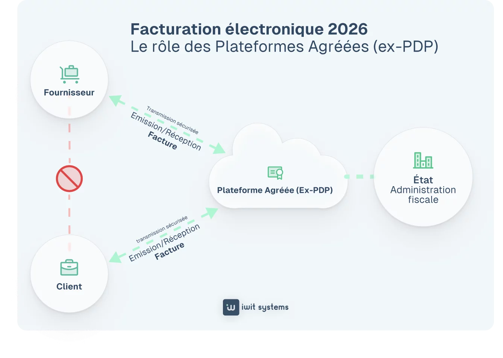
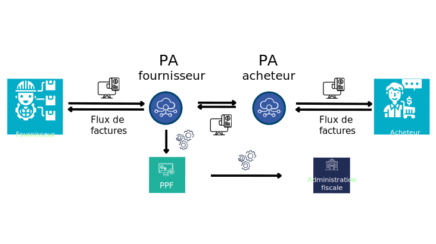

# Facturation électronique

À partir de septembre 2026, toutes les entreprises B2B et B2G en France seront tenues de passer à la facturation électronique.

Cela signifie que nous ne pourrons plus envoyer de copie papier de nos factures, ni de facture par e-mail. Chaque entreprise devra envoyer ses factures via un réseau agréé par le gouvernement, qui garantira la traçabilité des factures et leur cycle de vie.

L'objectif est que le gouvernement puisse contrôler plus finement toutes les transactions effectuées sur le territoire, disposer d'informations plus à jour sur la TVA due et prévenir le blanchiment d'argent.

Actuellement, le gouvernement oblige tous ses prestataires de services à envoyer leurs factures via un portail gouvernemental appelé [Chorus Pro](https://portail.chorus-pro.gouv.fr/).

## Plateformes Agrées

L'idée est d'assurer un acheminement traçable des factures de l'émetteur au destinataire.

Ceci sera réalisé par un réseau d'acteurs agréés par le gouvernement, appelés Plateformes Agréées (PA)

Chaque entreprise en France s'inscrira auprès de la PA de son choix. Lorsqu'elle émettra une facture, elle l'enverra à sa PA. La PA enregistrera la facture et la redirigera vers la PA du client pour réception 

([citation](https://www.iwit-systems.fr/blog/comment-choisir-sa-plateforme-agreee/))

([citation](https://www.dimo-dematerialisation.com/plateforme-dematerialisation-partenaire/))

Il existe actuellement [une liste restreinte](
https://www.impots.gouv.fr/liste-des-plateformes-agreees-immatriculees-sous-reserve) d'entreprises qui ont suivi le processus pour devenir PA, mais cette liste est provisoire, dans l'attente de l'approbation finale du gouvernement.

## Formats

Lorsque vous publiez une facture, afin que l'autorité publique puisse remplir sa mission de déclaration et de suivi, un format standard sera nécessaire pour la transmission de ces données entre les autorités publiques.

[Les leaders actuels sont](https://www.tgs-france.fr/faq/facture-electronique-formats-et-normes-applicables/) :

- Factur-X (format mixte composé d’un fichier de données structuré au format XML et d’un fichier PDF)
- Universal Business Language (UBL)
- Cross Industry Invoice (CII)

Factur-X s'intègre à la version PDF existante d'une facture, en ajoutant des métadonnées XML au fichier PDF. Ces métadonnées contiennent les informations sémantiques figurant dans la facture, telles que l'émetteur, le destinataire, les articles, les totaux, etc.

Vous pouvez obtenir toutes les informations nécessaires sur Factur-X et ses métadonnées, et même accéder à un validateur, sur le site officiel [FNFE-MPE.org](https://fnfe-mpe.org/factur-x/).
