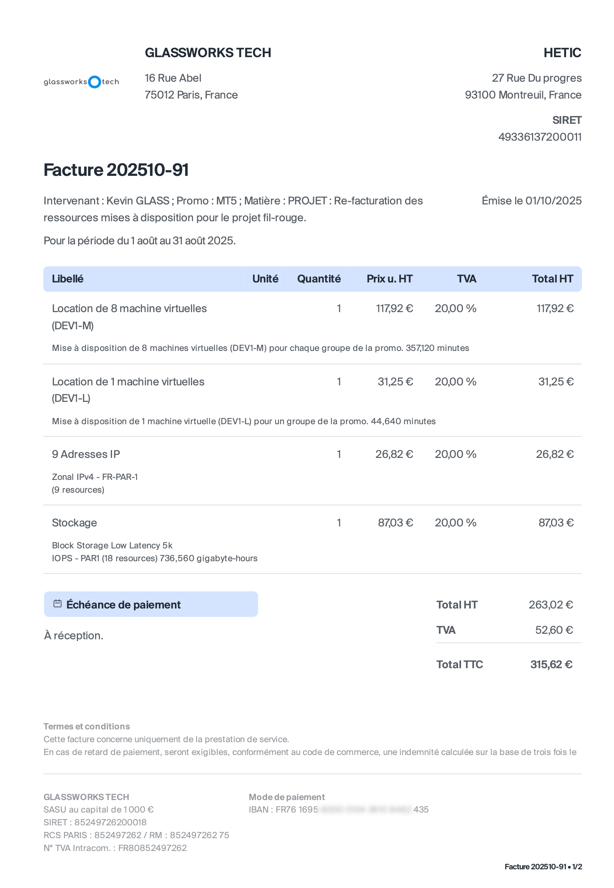

# Facture

Une facture est un document qu'une entreprise envoie à une autre pour indiquer un paiement dû. Il s'agit jusqu'à présent traditionnellement d'un document papier, et plus récemment d'un fichier PDF envoyé par e-mail.

Les factures doivent comporter un certain nombre de champs obligatoires :
- Numéro : un numéro unique et croissant qui identifie de manière unique la facture
- Date d'émission : date à laquelle la facture a été créée et envoyée
- Destinataire : nom de l'établissement, adresse, coordonnées, SIRET, numéro de TVA
- Émetteur : nom de l'établissement, adresse, coordonnées, SIRET, numéro de TVA
- Un tableau des articles ou services (unité, prix unitaire, TVA) vendus
- Un récapitulatif des totaux généraux (somme totale hors taxes, taxe totale, total)
- Les détails de paiement, généralement l'IBAN

Une liste plus ou moins complète des champs est disponible [ici](https://www.pennylane.com/fr/fiches-pratiques/facturation/quels-textes-de-loi-sappliquent-sur-les-factures).

Voici un exemple de facture envoyée à Hetic cette année :

