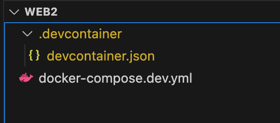
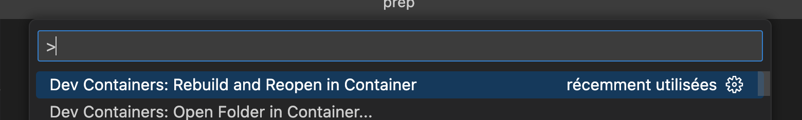

# Développement local

En tant que responsable technique, il est essentiel de garantir un environnement homogène dans lequel votre équipe peut travailler, sans être limitée par des problèmes de dépendance, d'installation, etc.

Pour une application Full-Stack, cela implique les éléments suivants :

- imposer un IDE de développement commun
- s'assurer que tous les environnements d'exécution sont identiques (avec la même version)
- s'assurer que l'équipe dispose du SGBDR (et de la version) appropriés et, idéalement, d'un instantané local d'une base de données de développement
- définir des règles pour le style du code, le linting, etc.
- mettre en place les référentiels GIT du projet, les stratégies de gestion des branches (par exemple [GitFlow](https://www.atlassian.com/fr/git/tutorials/comparing-workflows/gitflow-workflow))

Pour ce projet, il est impératif d'utiliser [Visual Studio Code (VSCode)](https://code.visualstudio.com) comme environnement de développement partagé.

Le client a déjà fourni son implémentation actuelle du projet, [My Invoice - disponible ici](https://dev.glassworks.tech/courses/fullstack/my-invoice).

Votre tâche consiste à configurer un environnement de développement commun qui fonctionne sur tous les ordinateurs de votre équipe.

## Docker Dev Containers

Il serait intéressant de créer un environnement de développement qui :

* facilement duplicable d'un ordinateur à l'autre
* indépendant du système d'exploitation
* contient le set de dépendances du projet (les versions des paquets par exemple)

Notamment, nous allons créer un API avec NodeJS qui tourne en Ubuntu Linux.

Nous utilisons Docker et VSCode afin de satisfaire ces demandes via leur [Dev Containers](https://code.visualstudio.com/docs/devcontainers/containers).

Il faut d'abord installer Docker et VSCode avant de procéder aux étapes suivantes. Un guide complet se trouve [ici](https://docs.glassworks.tech/unix-shell/introduction/010-introduction/installation-party).

On crée un container qui tourne une version du système d'exploitation et interprète de notre choix. Idéalement, ce seront les mêmes que l'on utilisera en production (par exemple, Ubuntu Linux).

VSCode s'attache à ce container de plusieurs façons :

* on monte le dossier de notre projet (en local) dans le container via l'élément `volumes` de `docker compose`.
* quand on ouvre un terminal dans VSCode, c'est l'équivalent de lancer un `docker exec -it [ID du container]`. On lance donc un interprète _dans le container_. On peut ensuite installer et lancer des processus provenant de notre développement (par exemple, lancer l'API) dans son environnement précis.

Pour accomplir tout cela, VSCode exige la présence d'un dossier `.devcontainer` à la racine du workspace.



The MyInvoice project already has Dev Containers set up ! The following sections just explain how it works and all the different pieces.



Nous commençons donc par le dossier dans notre dossier de travail `.devcontainer/devcontainer.json` dedans :


```json
{
  "name": "Invoice API",
  // Pointer vers notre docker-compose.dev.yml
  "dockerComposeFile": [
    "../docker-compose.dev.yml"
  ],
  // Le service dans docker-compose.dev.yml auquel on va attacher VSCode
  "service": "vscode_invoice_api",
  // Le dossier de travail précisé dans Dockerfile.dev
  "workspaceFolder": "/home/dev",
  // Set *default* container specific settings.json values on container create.
  "customizations": {
    "settings": {},
    "extensions": []
  },
  // Quelques extensions VSCode à inclure par défaut pour notre projet 
  "forwardPorts": [ 5050 ]
}
```



Si on analyse bien ce fichier, on voit que VSCode va consulter un fichier `docker-compose.dev.yml` qui existe dans le répertoire parent pour lancer les services nécessaires pour ce parent.

Ce docker-compose pourrait à la fois contenir un service pour notre VSCode, mais aussi une base de données (de l'image mariadb), et d'autres services comme **redis**, ou autre.



```yaml
services:
  vscode_invoice_api:
    image: rg.fr-par.scw.cloud/api-code-samples-vscode/vscode_api:2.0.2
    command: /bin/bash -c "while sleep 1000; do :; done"
    working_dir: /home/dev
    networks:
      - api-network
    volumes:
      - ./:/home/dev:cached
    labels:
      api_logging: "true"      
      
  dbms:
    image: mariadb
    restart: always
    ports:
      - "3309:3306"
    environment: 
      - MYSQL_ALLOW_EMPTY_PASSWORD=false
      - MYSQL_ROOT_PASSWORD=rootpassword
    command: [
      "--character-set-server=utf8mb4",
      "--collation-server=utf8mb4_unicode_ci",
    ]
    volumes:
      - ./.raw-data:/var/lib/mysql
    networks:
      - api-network

networks:
  api-network:
    driver: bridge
    name: api-network
```


Remarquez le service `vscode_invoice_api`, qui finalement tourne une commande `/bin/bash` en boucle infinie. VSCode s'attache à ce service. Le container est créé à partir d'une image que je vous ai déjà crée.

Le service `dbms` démarre une base de données MariaDB locale. Ceci est particulièrement utile, car cela nous évite d'installer séparément un SGBDR tiers.

Nous sommes prêts à lancer notre Dev Container. Vérifiez bien la structure de votre projet VSCode.

<figure><figcaption></figcaption></figure>

Vous pouvez ensuite lancer votre Dev Container en appuyant sur **F1**, et puis **Dev Containers : Rebuild and Reopen in Container**.

<figure><figcaption></figcaption></figure>

Une fois lancé, ouvrez un nouveau terminal.

Vous allez voir que NodeJS est déjà installé :

```bash
node -v
# v24.10.0
```

Au passage, nous avons installé **mycli** aussi, car on va travailler avec un SGBDR :

```bash
mycli --version
# Version: 1.26.1
```

Pour utiliser **typescript**, nous avons aussi ajouté **ts-node** et **typescript** comme commandes globales :

```bash
ts-node -v
# v10.9.2

tsc -v
# Version 5.9.3
```



Si vous avez des difficultés à démarrer votre dev-container, essayez ce qui suit :

- Ouvrez le Docker Dashboard, et essayez de supprimer tous les conteneurs qui pourraient être en conflit avec votre conteneur.
- Essayez de lancer `docker system prune -a --volumes` pour vider toutes les caches locales
- Redémarrez Docker
- Redémarrez votre ordinateur



Vous pouvez désormais exécuter cette version du projet.

```bash
# Installer les dépendances
npm install

# Lancer l'API
npm run api
```

Vous trouverez un exemple de collection Postman qui teste les différents points de terminaison de cette API dans le dossier `test`.




Le conteneur de développement ci-dessus utilise une image Docker que j'ai préparée pour vous : `rg.fr-par.scw.cloud/api-code-samples-vscode/vscode_api:2.0.2`.

Il s'agit d'une image que j'ai conçue pour vous et sur laquelle plusieurs outils utiles sont déjà installés.

Si vous souhaitez en savoir plus sur sa configuration et son déploiement, veuillez consulter [cette section du fichier README de My Invoice](https://dev.glassworks.tech/courses/fullstack/my-invoice#docker-image-for-development) 




## Style et qualité du code

Lors du codage dans des langages permissifs tels que Javascript ou Typescript, il est essentiel de définir des règles strictes concernant la manière dont le code doit être écrit et les normes à respecter.

En général, cela se fait à l'aide de **linters**, des logiciels supplémentaires qui analysent notre code à la recherche d'incohérences et les signalent sous forme d'erreurs ou d'avertissements.

Il est important de noter que ces erreurs n'empêchent pas le code de fonctionner, Javascript étant très permissif. Cependant, le linter peut s'avérer très utile pour détecter des incohérences susceptibles de causer de graves bugs par la suite. De plus, il harmonise considérablement la manière dont l'équipe code, ce qui est toujours une bonne chose.

Vous avez commencé à examiner le projet My-Invoice et avez constaté qu'il n'existe aucune règle de style de code.

Veuillez configurer l'outil [TypeScript ESLint](https://typescript-eslint.io/getting-started) dans le projet et exécuter le linter.
Y a-t-il des problèmes ? Certainement ! Votre tâche consiste à :

- résoudre les problèmes
- ou ajouter des règles ou des exceptions aux erreurs/avertissements qui semblent non pertinents dans votre cas.

## GIT

Maintenant que votre projet fonctionne sur votre machine locale, il est important de le transférer dans un dépôt GIT central afin de permettre la collaboration avec votre équipe.

Pour ce cours, nous allons utiliser une instance de Gitlab que je mets à votre disposition :

[https://gitlab.mt.glassworks.tech](https://gitlab.mt.glassworks.tech)

Vous pouvez vous créer un compte avec votre **adresse autre que `@hetic.eu`** (qui bloque les emails du serveur GitLab). 

**Merci d'utiliser votre vrai nom pour la création du compte pour que je puisse vous identifier plus facilement.**

N'oubliez pas de charger votre clé SSH pour plus simplement faire les clones et pull et push.

### Créer votre projet Gitlab

Connectez-vous au serveur Gitlab, créez votre premier projet, qui porte le nom `GROUPE_XX_MyInvoice` (en remplaçant le XX par le numéro de votre groupe):

- Le projet devrait être en mode `Private`. 
- Désactivez l'option de créer une `README.md`

Après avoir crée le projet, sur la page principale du projet, cliquez sur le bouton bleue "Code", et copiez le lien "https://...". Collez ce lien dans un fichier brouillon. Nous allons l'utiliser plus tard !

### Créer un jeton d'accès

Sur Gitlab, naviguez dans "Settings -> Access Tokens". Ajoutez un nouveau token avec les droits suivante :

- Role: "Maintainer"
- `read_repository`
- `write_repository`

Copiez le jeton généré. Attention, il n'est affiché qu'une seule fois ! Collez le jeton dans votre fichier brouillon. On va l'utiliser plus tard !

### Configurer GIT dans votre DevContainer

Retournez à votre projet VSCode.

Dans le terminal tapez, en remplaçant les coordonnées :

```sh
# Etablir notre identité
git config --global user.name "Your Name"
git config --global user.email "your.email@address"

# Préciser comment se souvenir de nos coordonnées de connexion
git config --global credential.helper "store --file $HOME/.git-credentials"
```

Ceci établit votre identité pour toues les interactions avec GIT.

### Préparer votre projet

Créez et sauvegardez votre projet :

```sh
git init -b main 

# Préciser qu'on va toujour fusionner nos modifications
git config pull.rebase false    

git add .
git commit -m "Ajouter la première version de mon code à GIT"
```

Une fois seulement, nous allons dire à GIT où synchroniser notre projet :
```sh
# Remplacez LE_LIEN_COPIÉ_DE_VOTRE_PROJET_GIT par votre lien https://gitlab.mt....
git remote add origin LE_LIEN_COPIÉ_DE_VOTRE_PROJET_GIT

# Récupérer la toute première version de notre projet de GIT
# Remplacez LE_LIEN_COPIÉ_DE_VOTRE_PROJET_GIT par votre lien https://gitlab.mt....
GIT_MERGE_AUTOEDIT=no git pull LE_LIEN_COPIÉ_DE_VOTRE_PROJET_GIT main --allow-unrelated-histories

# VSCode va afficher une interface en haut de l'écran demandant vos coordonnées de connexion :
# - précisez votre nom d'utilisateur gitlab quand demandé
# - coller votre token privé que vous avez généré dans Settings -> Access Tokens

# Il est possible qu'il y a un CONFLIT entre la version locale et la version récupérée du serveur
# Si c'est le cas, la commande précédente indiquera `CONFLIT` et affichera le fichier
# Ouvrez ce fichier et résolvez le conflit !

# Ajoutez des fichiers modifiés
git add .

# Puisque les 2 projets sont différents, nous allons sauvegarder les différences
git commit -m "Merge avec la version de gitlab"

# Envoyer notre version vers le serveur
git push --set-upstream origin main
```


Si vous vous êtes trompés de `origin` ou vous avez des erreurs concernant l'`origin`, on peut recommencer en faisant :

```bash
git remote delete origin
```


### Modifications futures

Quand vous apportez des modifications à votre base de code, vous pouvez désormais faire le suivant :

```sh
git add .
git commit -m "Le message qui décrit vos modifications"
git push
```

Si jamais une version plus récente existe sur le serveur, il faut d'abord faire :

```bash
git pull
```

... afin de récupérer cette version du serveur, avant de faire `git push`

Dans le cas où, en récupérant une version du serveur, git rencontre une erreur style "vous avez de modifications locales", il y a deux options :

```bash
# SOIT : enlever les modifications locales
git stash

# SOIT : créer une version à partir des modifications locales
git add .
git commit -m "un message"
```